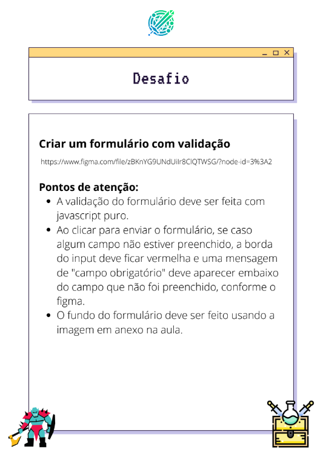
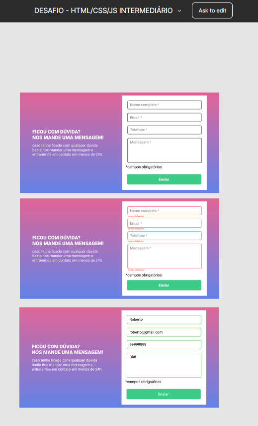
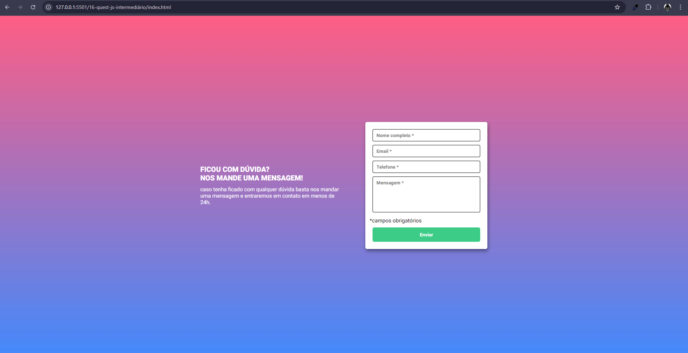

# Desafio Dev Quest - Formulário com validação

<b>Esta é uma solucção para o desafio do curso Dev Quest, onde estou desenolvendo minhas habilidades de HTML,CSS e JAVASCRIPT.</b>

## Visão Geral 👀

###  Projeto 📖
<b>Este é um projeto de validação de formulário, desenvolvido com Html, Css e Js. O objetivo do projeto é criar um formulário onde ele valida os inputs que estão preenchidos, criei também a parte responsiva.

###  Desafio 🎯
<b>O desafio consiste em construir um formulário com validação baseado nos designs fornecidos pelo figma. O formulário deve validar os inputs, adaptar a diferentes tamanhos de tela, e negar o envio com inputs vazios.

### Funcionalidades 🧠
<ul>
<li>Layout responsivo para diferentes tamanhos de tela
<li>Estados de hover e transition no button
<li>Manipulação do DOM
<li>Funcionalidades de validação pelo Js
</ul>

### Capturas de tela 📸

Desafio:

Layout do Figma:

Layout Desktop da minha solução:

Interatividade pelo desktop:

Interatividade pelo Mobile:

Design responsivos:

### Links 📌
<ul>
<li><a href="https://github.com/Igor0liveira/validacao-de-formulario">Repositório</a></li>
<li><a href="https://igor0liveira.github.io/validacao-de-formulario/" target="_blank">Deploy</a></li>
</ul>

## O que eu aprendi 📚

<b> Durante o desenvolvimento deste projeto, tive a oportunidade de consolidar e expandir minhas habilidades em desenvolvimento front-end. Aqui estão algumas das principais lições e aprendizagens:
<ul>
<li>HTML Semântico</li>
<li>CSS Flexbox</li>
<li>Responsividade e Media Querie</li>
<li>Estado de Hover e interatividade</li>
<li>Gerenciamento de projetos com Git</li>
<li>Manipulação do DOM</li>
<li>Laços de repetição</li>
</ul>

## Desenvolvimento contínuo 🚀
<b>Durante o desenvolvimento deste projeto, identifiquei várias áreas nas quais gostaria de continuar me aprimorando e explorando em projetos futuros. Como:
<ul>
<li>Animações e transições em CSS</li>
<li>Clean Code</li>
<li>Flexbox</li>
<li>Responsividade</li>
<li>Uso do HTML semântico</li>
<li>Manipulação do DOM</li>
<li>Interação com Js</li>
</ul>

### Próximos Passos 👣
<b>Para continuar meu desenvolvimento nessas áreas, planejo:
<ul>
<li>Participar de mais desafios no Frontend Mentor e outras plataformas similares.</li>
<li>Concluir os meus cursos de programação.</li>
<li>Fazer sites como freelancer para adquirir experiências.</li>
</ul>

## Agradecimentos 👏

<b>Agradeço ao curso Dev Quest por fornecer um ambiente de aprendizado rico e estruturado. A qualidade do conteúdo e o suporte oferecido foram fundamentais para o meu desenvolvimento como programador.
Obrigado a todos por tornarem esta caminhada possível e por me ajudarem a alcançar este marco significativo em minha carreira de desenvolvimento. Estou animado para continuar aprendendo e crescendo com o apoio de todos vocês.
